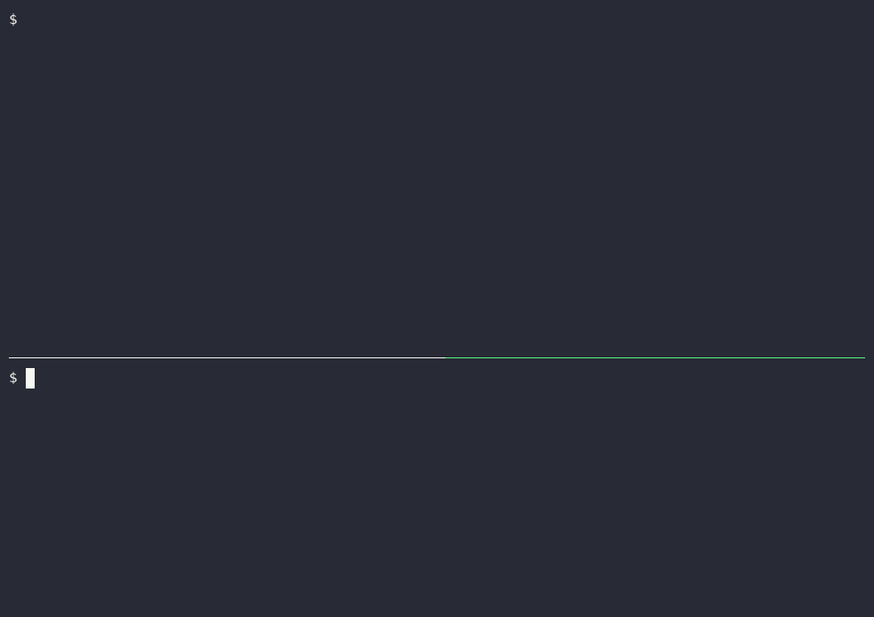

# smolmux

A portable C11 device multiplexer. Holds a device connection open (serial UART, GDB stub) and multiplexes access to multiple clients over Unix sockets using newline-delimited JSON.

Single static binary, low latency, small footprint - built for daily serial and
GDB bring-up on Linux.

> **New here?** [**docs/START-HERE.md**](docs/START-HERE.md) is a one-screen router - find your intent (run it, bring up a new board with an AI agent, understand the architecture, hack on the code) and it points you to the right doc.

## One port, three clients



One broker holds an ESP32-S3's UART. The monitor (top) watches it live. In the
bottom pane a script sends `temp` and gets the reply on the same wire, resets
the board and waits for its prompt, then esptool reads the flash ID through
`with-port`: the broker suspends, esptool runs, the broker resumes, and the
monitor never loses the port.

## Example: probe an unknown board

One broker holds SWD; `smolmux-gdb-mcp` runs **`probe_unknown_board`**. On a
**SAM C21 Xplained Pro** that path decoded Cortex-M0+ from CPUID, named the
part via SAM DSU DID, rejected a false STM32 match, and wrote a starter
`*.gdb-profile.json`. Tools, register values, and profile shape:
[docs/demo-samc21-probe-transcript.md](docs/demo-samc21-probe-transcript.md).

Day-to-day serial (multi-client, U-Boot break-in, flasher handoff):
[docs/daily-driver.md](docs/daily-driver.md).

## Features

- **Serial UART**, **GDB MI**, and **serial-over-TCP** (telnet + RFC2217) device links via vtable polymorphism
- **Multiple concurrent clients** over Unix sockets with role-based access (observer/controller/takeover)
- **Expect engine** - concurrent regex matching on the device byte stream with timeouts
- **Anomaly detection** - pattern-based crash/error detection with cooldown and incident tracking
- **Output history** - timestamped ring buffer for replay by late-joining clients
- **Structured logging** - JSONL I/O log + human-readable text log with rotation
  (the I/O log records everything sent to and from the device, including
  anything typed at a login prompt — it is created `0600` under your private
  state directory, and smolmux refuses to write it through a symlink or to a
  file owned by another user)
- **Network sinks** - TCP and WebSocket for remote access (loopback by default).
  The wire protocol is cleartext, and any client that completes the handshake
  gets full control of the device — console writes, pins, BREAK, SysRq, GDB.
  On loopback without `--auth-token`, the broker generates a token into a
  `0600` file in `$XDG_RUNTIME_DIR` (or `/tmp`), so other local users and processes
  cannot connect; your own `smolmux-monitor` / `smolmux-mcp` read it
  automatically, and `smolmux-cli token` prints it. For remote use, keep the
  bind on loopback and reach it over an SSH tunnel or WireGuard rather than
  exposing the port; smolmux refuses to serve a non-loopback TCP bind with no
  `--auth-token`. `--insecure-no-auth` turns both protections off.
- **MCP servers** - standalone `smolmux-mcp` / `smolmux-gdb-mcp` attach to a running broker; optional in-process `--mcp` sink for single-process stdio
- **Boot tracking & autoresponder** - ordered boot stages, stall events, standing expect->send rules
- **Autoboot interrupt** - broker-side key flood (and optional DTR/RTS reset) for `bootdelay=0` U-Boot
- **Device profiles / board manifests** - JSON configs for prompts, anomalies, multi-wire boards
- **Auto-reconnect** - exponential backoff recovery on USB-serial disconnect
- **Build-time feature selection** - Kconfig-based; UART-only builds carry no GDB/TCP/WebSocket code

## Quick start

Prerequisites: Linux, a C11 compiler, CMake 3.21+, Python 3 with
[kconfiglib](https://pypi.org/project/kconfiglib/) (the configure step
generates the feature header with it). `libpcre2-8` is optional; without it
regex matching falls back to POSIX.

```bash
# Debian/Ubuntu
sudo apt install build-essential cmake python3 python3-pip libpcre2-dev
pip install kconfiglib   # or in a venv; Debian's system Python may need
                         # --break-system-packages
```

```bash
cmake -B build && cmake --build build -j$(nproc)
./build/smolmux /dev/ttyUSB0
```

Connect a client:

```bash
# Needs a running broker (above). Auto-discovers the socket from the port name.
./build/smolmux-monitor /dev/ttyUSB0
```

Day-to-day workflows (profiles, logs, U-Boot break-in, multi-wire boards):
[docs/daily-driver.md](docs/daily-driver.md). Intent router: [docs/START-HERE.md](docs/START-HERE.md).

## Build

```bash
cmake -B build && cmake --build build -j$(nproc)   # Default (all features)
ctest --test-dir build                               # Run tests
```

### Feature profiles

```bash
cp configs/defconfig.minimal .config && cmake -B build    # UART only, no sinks/watcher
cp configs/defconfig.uart .config && cmake -B build       # UART + MCP sink + watcher
cp configs/defconfig.embedded .config && cmake -B build   # Embedded target profile
cp configs/defconfig.full .config && cmake -B build       # Everything (GDB, TCP, WS, MCP, watcher)
```

Or toggle features directly:

```bash
cmake -B build -DSM_ENABLE_GDB=OFF -DSM_ENABLE_SINK_WS=OFF
```

Developer benchmarks (e.g. the output coalescer harness) are off by default:

```bash
cmake -B build -DSM_BUILD_BENCH=ON && cmake --build build --target bench_coalesce
```

Interactive configuration:

```bash
cmake --build build --target menuconfig
```

### Static builds

```bash
cmake -B build -DSM_MUSL_STATIC=ON    # Fully static musl binary (zero runtime deps)
cmake -B build -DSM_STATIC=ON         # Static linking (except glibc)
```

## Usage

```
smolmux <port> [options]

Options:
  -b, --baud <rate>           Baud rate (default: 115200)
  -s, --socket <path>         Unix socket path
  -l, --log-dir <dir>         I/O log directory
                              (default: $XDG_STATE_HOME/smolmux or
                               ~/.local/state/smolmux)
  -t, --text-log-dir <dir>    Text log directory
  -p, --profile <path>        Device profile JSON file
  --board <name>              Group this wire under a board (for discovery)
  --role <label>              This wire's role on the board (console, swd, ...)
  --gdb                       Use GDB MI link instead of UART
  --gdb-path <path>           Path to gdb binary (default: gdb)
  --gdb-target <spec>         GDB target (e.g., localhost:3333)
  --serial-tcp <host:port>    Connect to a serial-over-TCP device server
                              (ser2net, socat, terminal server; telnet +
                              RFC2217 baud/DTR/RTS/break control)
  --mcp                       Enable in-process MCP stdio sink (prefer standalone
                              smolmux-mcp against a daemon broker for daily use)
  --tcp-port <port>           Enable TCP sink (default: 5555)
  --tcp-bind <addr>           TCP bind address (default: 127.0.0.1)
  --auth-token <token>        Require token in hello from TCP clients
                              (prefer env SMOLMUX_AUTH_TOKEN - hidden from ps)
  --auth-token-file <path>    Read the token from a file
  --insecure-no-auth          Serve TCP/WS with no token. Without it, a
                              loopback listener gets a generated token
                              (0600 file; smolmux-cli token prints it) and
                              a non-loopback --tcp-bind is refused.
  --ws-port <port>            Enable WebSocket sink (default: 5556)
  --no-text-log               Disable text log
  --no-io-log                 Disable JSONL I/O log
  --no-reconnect              Don't auto-reconnect on disconnect
  --wait-device <seconds>     Wait for the device path before open
  --gdb-allow-shell           Permit GDB shell/python/eval (off by default)
  --list-ports                List available serial ports and exit
  --list-profiles             List available device profiles and exit
  --help-protocol             Show wire protocol documentation
  -v, --verbose               Enable debug logging
  -V, --version               Show version
  -h, --help                  Show this help
```

## Wire protocol

Newline-delimited JSON over Unix sockets (also TCP/WS sinks). Binary data is
base64-encoded. Message set covers session control, expect, history, anomaly,
boot stages, autoboot flood, and autoresponder.

Full reference: `./build/smolmux --help-protocol` (always matches this binary).

**Client -> Broker:** `hello`, `send`, `send_expect`, `takeover`, `release`, `status`, `pin_control`, `set_baud`, `suspend`, `resume`, `history_request`, `incidents_request`, `configure_anomaly`, `interrupt_autoboot`, `configure_autoresponder`, `autoresponders_request`

**Broker -> Client:** `welcome`, `output`, `input_echo`, `expect_result`, `status_response`, `error`, `history_response`, `incidents_response`, `anomaly`, `autoboot_result`, `boot_stage`, `boot_stall`, `autoresponders_response`, `autoresponder_fired`, `suspended`, `resumed`, `link_down`, `link_up`

Example session:

```json
-> {"type":"hello","name":"my-tool","role":"controller","protocol_version":1}
<- {"type":"welcome","broker_version":"x.y.z","protocol_version":1,"port":"/dev/ttyUSB0","baud":115200,"your_role":"controller"}
-> {"type":"send","id":"1","data":"dW5hbWUgLWEK"}
<- {"type":"output","data":"TGludXggNC4xOS4w...","timestamp":1709654321.123}
```

## Architecture

```
┌───────────┐  ┌───────────┐
│ uart link │  │  gdb link │   <- device-facing, compiled in/out via Kconfig
└─────┬─────┘  └─────┬─────┘
      │              │
      ▼              ▼
┌──────────────────────────────┐
│         smolmux core         │  <- epoll event loop, message bus,
│  history · logging · anomaly │    role enforcement, expect engine
└──┬───────┬───────┬───────┬───┘
   │       │       │       │
   ▼       ▼       ▼       ▼
┌──────┐┌─────┐┌─────┐┌──────┐
│ unix ││ tcp ││ ws  ││ mcp  │  <- sinks, also compiled in/out
│socket││sink ││sink ││ sink │
└──────┘└─────┘└─────┘└──────┘
```

See [DESIGN.md](DESIGN.md) for full architecture documentation.

## Dependencies

**Required:** cJSON (vendored, single file)

**Auto-detected:** PCRE2 (`libpcre2-8`). Used as the regex engine when
present, because it bounds backtracking internally; the build falls back to
POSIX ERE automatically when it is absent, so it is never required. Force
either way with `-DSM_ENABLE_PCRE2=ON` (error if missing) or
`-DSM_ENABLE_PCRE2=OFF`.

Core has zero *required* external dependencies beyond POSIX + cJSON.

## Companion tools

- **smolmux-cli** - command-line client (send commands, read output; `with-port <cmd>` suspends the port, runs an external tool like a flasher, then always resumes)
- **smolmux-monitor** - interactive terminal client with escape sequences (prefix key then a command; prefix defaults to Ctrl-], change with `-e`, e.g. `-e esc` or `-e ^A`)
- **smolmux-mcp** - standalone MCP server: connects to a running broker and exposes serial tools (`serial_send_command`, `serial_read`, `serial_boot_status`, `serial_add_autoresponder`, ...). Alternative: broker `--mcp` sink embeds MCP in-process.
- **smolmux-gdb-mcp** - standalone MCP server for GDB debugging: 21 tools over a
  broker holding a `--gdb` link - breakpoints, stepping, backtrace, name-labeled
  registers, memory, expression eval, fault-register decode (where the core has
  them), peripheral reads, `gdb_interrupt`, and unknown-board probing on
  **ARM Cortex-M** today (`gdb_identify_target` / `gdb_generate_profile`; other
  architectures are planned). Resources and prompts include
  `smolmux-gdb://board-probing` and `probe_unknown_board`. Built when
  `SM_ENABLE_GDB` is on; chip-ID validated on a SAM C21 Xplained Pro.
- **smolmux-watcher** - daemon that monitors for anomalies and saves incident reports to disk

## Related Documentation

- **[Start here](docs/START-HERE.md)** - One-screen intent router (daily use, new board, architecture, hacking).
- **[MCP setup](docs/MCP-SETUP.md)** - Register `smolmux-mcp` / `smolmux-gdb-mcp` with Claude Code, Claude Desktop, or Cursor.
- **[Daily driver](docs/daily-driver.md)** - Recommended build, runtime flags, U-Boot break-in, boot stages, boards, coexistence with flashers.
- **[Board Exploration Workflow](docs/board-exploration-workflow.md)** - Runbook for a fresh board (manually or with an AI agent): wires, SWD identify, console, peripherals.
- **[Board Bring-up Template](docs/board-bringup-template.md)** - Copy-per-board fact-capture template.
- **[Persistent Serial Device Names](docs/persistent-serial-devices.md)** - Stable names for UART dongles (`/dev/serial/rpi-console` etc.).
- **[Hardware validation matrix](docs/hw-validation.md)** - What is validated on real hardware vs not yet proven.
- **[DESIGN.md](DESIGN.md)** / **[CLAUDE.md](CLAUDE.md)** - Architecture and contributor map.

## Free vs Pro

Everything in this repository is MIT-licensed - full source, wire protocol,
generic device profiles, build system. Build it yourself and you have the
complete product.

**smolmux Pro** is convenience, not a feature gate: prebuilt static binaries
(x86_64 + aarch64, musl, zero runtime dependencies), the curated profile pack
with per-profile notes, and **6 months** of email support. One-time purchase
(**$79**). MCP setup for zip paths is `docs/MCP-SETUP-FULL.md` (also in
this public tree).

**[Buy smolmux Pro - $79 one-time](https://buy.polar.sh/polar_cl_bby5IXfnmPSq6W8SLy0wzHDFm5nXch62djGUX4WXXZT)** -
download includes current static binaries and the profile pack.

## License

[MIT](LICENSE). cJSON is vendored under its own MIT license
(`deps/cJSON/LICENSE`).
